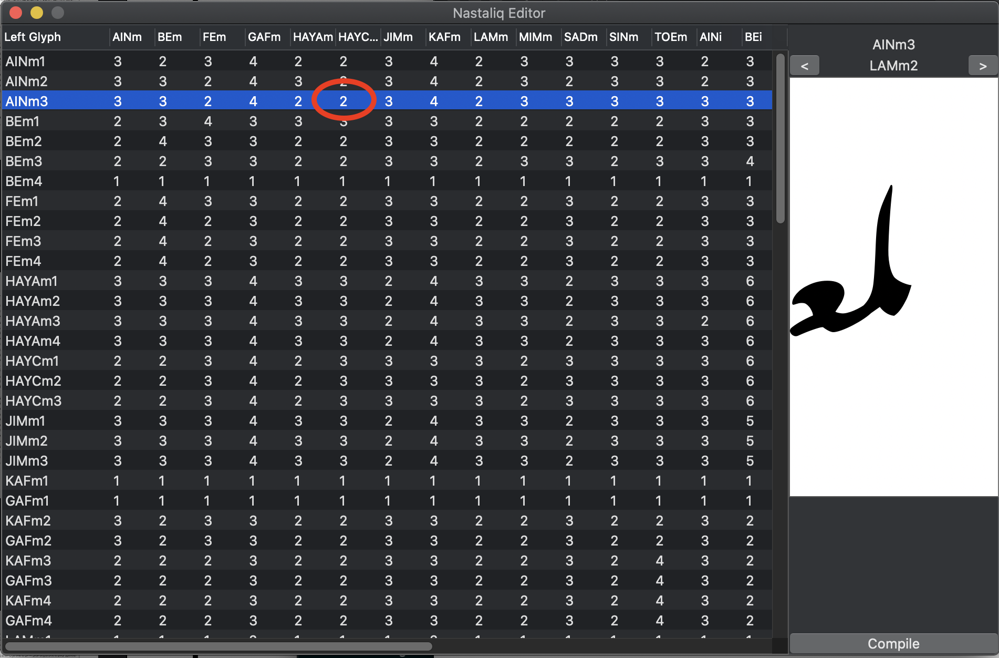

# Nastaliq Font Engineering Process

*Please note: the engineering in this font is currently unfinished. Mark position and mark-to-mark positioning is incomplete, some ligatures are unused, and some glyph connections are incorrect.*

The purpose of this repository is to explain how I approach engineering Nastaliq fonts. I hope that this guide will help other people to develop their own Nastaliq fonts.

I will be using outlines from Mehr Nastaliq as an example. Mehr Nastaliq is a font developed by Zeeshan Nasar and based on the calligraphy of Nasrullah Mehr. Thanks to Nasar and Mehr for making the font available under a Creative Commons license.

## Stages of engineering

The way I engineer Nastaliq fonts is a development of the process designed for Linotype Qalmi. The patent for Linotype Qalmi explains this process, so I encourage you to read it carefully. The patent has now expired, and you are allowed to use the process for your fonts.

### Preparation and glyph renaming

First, I opened Mehr Nastaliq in Glyphs and saved it as a Glyphs file. I converted all the outlines from quadratic to cubic curves.

Thankfully Mehr Nastaliq is designed in the way that we need - rasm glyphs and nukta forms are separated, and will be connected together using anchors. If this was not the case, we would have to remove the nuktas and place them in separate glyphs.

Next, I identified all the different forms of each letter and began to rename the glyphs. The process I use relies on a specific glyph naming scheme. The Qalmi patent describes the naming scheme, but I will explain it briefly here.

Each glyph which forms part of the *rasm* has three components in its name. The first part is the name of the letter in capitals: for example, BE, JIM, SIN. The second part identifies the form of the glyph: "i" for initial, "m" for medial, "f" for final, and "u" for isolated. The third part is a number identifying the variation. For example, Mehr has six forms of the initial "beh" glyph, which I have named "BEi1 ... BEi6".

Mehr also includes a number of ligature glyphs. Qalmi does not use ligatures, so to integrate these ligature glyphs we must come up with a suitable naming convention. I decided to see the ligatures as simply another rasm element and named them as if they were any other glyph. So the ligature "medial shin, final heh goal" is treated as a final glyph, and named "SIN_HAYCf1".

The naming convention I use for nukta glyphs also comes from Qalmi: single dot below is "sdb", double dot above is "dda" and so on.

## Empty glyphs and Unicode mapping

We also need to make sure that the font contains glyphs to "hold" the incoming characters, even if the glyphs are empty. For example, the letter "beh" will be decomposed into two glyphs - `BEu1` (all incoming characters begin their shaping journey as isolated forms) and `sdb`.

It is up to you how you handle this. Some people like to have an empty `beh-ar` glyph with mapping U+0628, which is then decomposed later into `BEu1 sdb`. I try to avoid having empty glyphs as much as possible, so I take a shortcut - I map `BEu1` (dotless isolated beh) to U+0628 and then I substitute `BEu1 by BEu1 sdb`. But it doesn't really matter.

Whichever way you choose to map your glyphs, you should *not* have a precomposed beh-with-dot-below glyph. Rasm glyphs and ijam/tashkil glyphs should be separate.

We also need to create a separate set of below-rasm nukta glyphs (and a kasra glyph) which are involved in the bari ye handling operation. These will be called `sdb.yb`, `ddb.yb`, `tdb.yb` and `KASRA.yb`. They will be duplicates of the normal nukta and kasra glyphs but will not have any anchors. (In the future these glyphs will be automatically generated by the FEE processor, but for now we have to create them manually.)

Finally, we will change the sidebearings of some final glyphs so that their cursive connection entry point is the right boundary. The glyphs we will change are those mentioned in the Qalmi patent for special handling: BARI_YE, final JIM, and final AIN. After these glyphs have been adjusted, they will have a large negative right sidebearing.

## Connection editor

Now that the glyphs are renamed according to our naming scheme, we can use the Nastaliq Connection Editor script for Glyphs to specify how the forms connect together. Add the script to your Glyphs scripts directory, and make sure you have installed the "vanilla" Python module. (You can do this by opening the preferences menu, selecting the "Addons" icon from the toolbar, opening the "modules" tab, and clicking on "Install Modules".)

Open Nastaliq Connection Editor from the Script menu, and you should see a screen like the one below.

Each number represents a choice of connection between the glyph on the left column and the glyph at the top. For example, the highlighted cell shows that when we have a medial lam / medial ain sequence with an "AINm3" glyph on the left, the correct form of medial lam is variant 2 ("LAMm2"). To control the connections, click on each cell in the grid and use the arrows on the right to find the correct connecting form.

*There may be some mistakes in my choice of connections for Mehr Nastaliq. Please let me know if you see some! I hope you can still see how useful the system is, even if I have got some parts wrong.*

The connection information will be used to write a set of GSUB8 "reverse contextual substitution" rules. The "reverse contextual substitution" operation is not very well known, but it is just what we need for Nastaliq connections. Indeed, it was designed specifically for Nastaliq fonts. It begins at the end of an Urdu "word" and applies substitutions to a pair of glyphs, substituting the glyph on the right based on the glyph on the left.

The Nastaliq Connection Editor script has a button at the bottom allowing you to "compile" the connection information into a Glyphs feature. If you want to write your Nastaliq feature code "by hand", you can use this. We are instead going to use the FEE language to express our layout rules because it can automatically create some of the rules we need. When we come to handle bari ye, you will realise why it is better to use FEE than Adobe feature language...

## Writing the layout code

The FEE language is an alternative font layout and engineering language which allows us to write our rules at a higher level. It is implemented in the `fontFeatures` Python module. You will need to install this module, and read the documentation for the FEE language [here](https://fontfeatures.readthedocs.io/en/latest/fee-format.html).

This repository contains the FEE code for the font. I have tried to include as many comments as possible to make the code easier to understand. I suggest that you first read this overview of what the layout code needs to do, and then read through the FEE file.

* First, we use the `ccmp` feature to decompose the incoming characters into rasm and tashkil/ijam. This decomposition will need to be "fixed up" later in some cases where the pointing is different for initial, medial, final and isolated forms. For example, choti ye takes no nukta at this stage but will turn into `BEi1 ddb` in initial form and `BEm1 ddb` in medial form.

* Next, we need to do the usual conversion from isolated forms to final, medial and initial forms in the `fina`,  `medi`, `init` features. Because we have a regular naming scheme, we can use a FEE plugin to substitute anything ending `u1` to the same name ending `f1` in the `fina` feature. In the `fina` feature, we also begin to select any variant final forms based on what follows them. This is explained in the Qalmi patent. I have not implemented this yet for Mehr, because I am not clear when alternative final forms should be chosen.

* The next task is to select the right forms of the glyphs to make fluid connections. For Mehr, there are two parts to this: substituting the ligature glyphs and using the Nastaliq Connections table. In the build scripts, which I will describe below, we extract the connections information from the `.glyphs` file and turn it into a comma-separated value (CSV) table. We use a custom FEE plugin to read the CSV file and generate the reverse contextual substitution rules. This takes place in the `rlig` (required ligatures) feature.

* Also within the `rlig` feature, we need to handle nukta and mark clashes in the bari ye and other final glyphs (JIM, AIN) with negative right sidebearings. This is handled automatically with the `BariYe` FEE plugin.
Next, we perform mark positioning and cursive attachment. We use a build script to extract the anchors from the `.glyphs` file and rewrite those anchors in FEE format.

* Finally, we fix up any mark clashes. The most important part of this is what the Qalmi patent describes as the "knock-on value". This means that sequences of consecutive nuktas need to have spacing added to *each* nukta to separate them out. This is handled by another FEE plugin. Further rules separate marks from base characters. *This part is a work in progress; the current set of rules is borrowed from another font and needs adjusting for Mehr.*

Now, I suggest reading through the FEE file to understand how I implemented each of these operations.

## Build scripts

This repository also contains FEE plugins for Nastaliq as well as scripts to build the font file:

* `dump-glyphs-rules.py` turns the Nastaliq Connection information within the `.glyphs` file into a CSV file so that it can be processed by the `nastaliqTools.NastaliqConnections` plugin.
* `dump-fee-anchors.py` turns the anchors within the `.glyphs` file into FEE format so that they can be used in `Anchor` rules.
* `gnipahs.py` is a shaping regression test for fontbakery, called from `make test`.
* The `Makefile` builds the font, as well, as running the regression tests and various test proofs.

